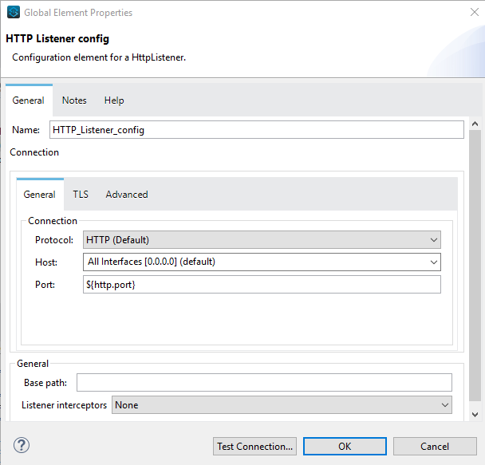

= Splunk Connector

== DOCUMENT REVISION HISTORY

[%header%autowidth.spread]
|===
|Version  |Release Date |Revised by |Comments/ Indicate Sections Revised

|A |B |C |D.

|===

== ⦁	List of Operations Supported by the  Splunk Connector:

[%header%autowidth.spread]
|===
|Sr.No |Business Function |Operations |Description |Inbound |Outbound
|1 |Run one shot search |POST request |Run one shot search is used for creating search id for jobs.|Required parameters are optional. |Return JSON or XML response according to the configuration done.
|2 |Get jobs |GET Request |Get jobs operation is used to get details of all existing jobs.|Required parameters are optional.| Return JSON or XML response according to the configuration done.
|3.1 |Run blocking search |GET request |Run blocking search operation  for get is used for accessing the search job based on search id. |Required parameters are optional. |Return JSON or XML response according to the configuration done.
|3.2 |Run blocking search |POST request |Run blocking search operation  for post is used for creating search id. |Custom is the required parameter.|Return JSON or XML response according to the configuration done.
|4 |Get applications |GET request |Get applications is used to manage local apps. |Required parameters are optional. |Return JSON or XML response according to the configuration done.
|5 |Get saved search |GET request |Get saved search is used for accessing saved search configurations. |Required parameters are optional. |Return JSON or XML response according to the configuration done.
|6 |Create saved search |POST request |Create saved search Operation is used for creating saved search. |*Name* and *Search* are the required parameters. |Return JSON or XML response according to the configuration done.
|7 |View saved search properties |GET request |View saved search properties Operation is used for accessing search configurations based on Search name. |Required parameters are optional. |Return JSON or XML response according to the configuration done.
|8 |Modify saved search properties |POST request |Modify saved search properties operation is used to modify saved search configuration. |Name and search are the required parameters. |Return JSON or XML response according to the configuration done.
|9 |Get saved search history |GET request |Get saved search history operation is used to list available search jobs created from the {name} saved search. |Required parameters are optional. |Return JSON or XML response according to the configuration done.
|10 |Run saved search |POST request |Run saved search operation  is used to dispatch saved search. |Required parameters are optional. |Return JSON or XML response according to the configuration done.
|11 |Delete saved search |DELETE request |Delete saved search operation is used to delete specific saved search. |No required parameters. |Return JSON or XML response according to the configuration done.
|12 |Get data model |GET request |Get data model operation is used to access specific data models. |Required parameters are optional. |Return JSON or XML response according to the configuration done.
|13 |Get data models |GET request |Get data models operation is used to list data models on the server. |Required parameters are optional. |Return JSON or XML response according to the configuration done.
|14 |Get inputs |GET request |Get inputs operation is used to list all inputs,including modular inputs. |Required parameters are optional. |Return JSON or XML response according to the configuration done.
|15 |Get input |GET request |Get input operation is used to list details for the {name} input. |Required parameters are optional. |Return JSON or XML response according to the configuration done.
|16 |Create input |POST request |Create input operation is used to create the token. |*Name* is a required parameter. |Return JSON or XML response according to the configuration done.
|17 |Modify input |POST request |Modify input operation is used to update token configuration information. |*Name* is a required parameter. |Return JSON or XML response according to the configuration done.
|18 |Remove Input |DELETE request |Remove Input operation is used to delete the operation. |No required parameters. |Return JSON or XML response according to the configuration done.
|19 |Add Data To Tcp Input |POST request |Add Data To Tcp Input operation is used to update the container for managing data. |Required parameters are optional. |Return JSON or XML response according to the configuration done.
|20 |Add Data To Udp Input |POST request |Add Data To Udp Input operation is used to edit properties of the named UDP data input. |Required parameters are optional. |Return JSON or XML response according to the configuration done.
|21 |Get Indexes |GET request |Get Indexes operation is used for listing the recognized indexes on the server. |Required parameters are optional. |Return JSON or XML response according to the configuration done.
|22 |Create Index |POST request |Create Index operation is used for creating a new index. |Required parameters are optional. |Return JSON or XML response according to the configuration done.
|23 |Modify indexes |POST request |Modify indexes operation is used for updating the {name} index. |Required parameters are optional. |Return JSON or XML response according to the configuration done.
|24 |Get Index |GET request |Get Index operation is used for accessing information about the {name} index. |Required parameters are optional. |Return JSON or XML response according to the configuration done.
|25 |Clean Index |POST request |Clean Index operation is used to cleanIndex. |Required parameters are optional. |Return JSON or XML response according to the configuration done.
|26 |Remove Index |DELETE request |Remove Index operation is used to remove the {name} index and the data contained in it. |No required parameters. |Return JSON or XML response according to the configuration done.
|27 |Add Data To Index |POST request |Add Data To Index operation is used for updating the {name} index. |Required parameters are optional. |Return JSON or XML response according to the configuration done.
|===

==  ⦁   Configuration for Splunk Connector
To use Splunk Connector, you will require the following configuration properties.

    Baseurl : Hostname  and URL of server hosting Splunk Server.

    Username : Enter the username  of Splunk server to log in with.

    Password : Enter the corresponding password.

    Connection timeout : Timeout for connection, in milliseconds.

    Connection Idle Timeout : Timeout for connection, in Seconds(Default).

==  ⦁   Use case – Connectivity with salesforce

This use-case demonstrates the interaction between Splunk and Salesforce systems using SPUNK connector. It utilises POST, GET and DELETE operations connectors.

For running this use-case we need following configurations as prerequisites:

⦁ Drag and drop an HTTP Listener in the canvas.

⦁ In the Listener properties, give a path you want to use to trigger the listener.

⦁ Add a new Configuration as follows,

⦁ Test the connection and click on Okay.

⦁ Make sure your mule palette has Salesforce and Splunk modules. If you do not have Salesforce module in your palette, go to add module -> Salesforce and drag it to your palette.

⦁ Now add configurations for Splunk.

⦁ Go to global-configurations.xml global elements -> create -> Connector Configuration -> Splunk Configuration

⦁ Add following properties.

    Baseurl

    Username

    Password

    Connection timeout

    Connection Idle Timeout

image:img/global_config.png[]

image:img/global_config_timeout.png[]

image:img/global_config_advanced.png[]

⦁	Add Salesforce configuration.
⦁	Go to global-configurations.xml -> global elements -> create -> Connector Configuration -> Salesforce Configuration
⦁	Add following properties

image:img/salesforce_global_config.png[]

⦁	Create a flow with the components displayed in the image below:

== UsesCases are defined below:

== createIndex:

 This  use case demonstrates the creating Index:

⦁  The flow gets started by Setting a variable name Index where we are fetching the name from query Params then Creating the Index using the Splunk create Index operation with name set in the variable, then we are again a setting variable named Index Links and using a transform message to do the transformation for Salesforce Database.

⦁  We are creating Index details in salesforce by using salesforce connector create with that payload obtained from transform message.

⦁  Atlast we are adding a transform message to get the response in JSON.

image:img/createIndex.png[]

== add Data To Index:

 This  use case demonstrates adding data to the created Index i.e, updating the Index:

⦁  The flow gets started by Setting a variable name Index Name where we are fetching the name from query Params then we are retrieving  Index details by using query operation salesforce connector and then using a transform message to convert the Java response to Json.

⦁  Then we are using the add data to Index Splunk operation for updating the Index that is created before and after that we use a transform message to get the response in Json.

image:img/addDataToIndex.png[]

== remove Index:

 This  use case demonstrates removing Index that is created :

⦁  The flow gets started by Setting a variable name Index Name where we are fetching the name from query Params then we are retrieving  Index details by using query operation salesforce connector and then using a transform message to convert the Java response to Json.

⦁  Then we are using the remove Index Splunk operation for deleting  the Index that is created before and after that we use a transform message to get the response in Json.

image:img/removeIndex.png[]

