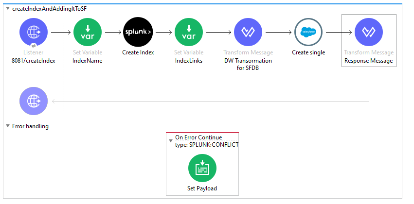

= Splunk Connector

== DOCUMENT REVISION HISTORY

[%header%autowidth.spread]
|===
|Version  |Release Date |Revised by |Comments/ Indicate Sections Revised

| 3 | 15th Dec 2020 | Connector Development Team |

|===

== ⦁	List of Operations Supported by the  Splunk Process Connector:

[%header%autowidth.spread]
|===
|Sr.No |Business Function |Operations |Description |Inbound |Outbound
|1 |Run one shot search |POST request |Start a new search and return the search ID (<sid>).|*Search* is the required parameter. |Return JSON or XML response according to the configuration.
|2 |Get jobs |GET Request |Get details of all current searches.|Parameters optional.| Return JSON or XML response according to the configuration.
|3 |Run blocking search |GET request |Get information about the {search_id} search job.|Custom is the required parameter.|Return JSON or XML response according to the configuration.
|4 |Get applications |GET request |List installed apps and properties. |Parameters optional. |Return JSON or XML response according to the configuration.
|5 |Get saved search |GET request |Access saved search configurations. |Parameters optional. |Return JSON or XML response according to the configuration.
|6 |Create saved search |POST request |Create a saved search.|*Name* and *Search* are the required parameters. |Return JSON or XML response according to the configuration.
|7 |View saved search properties |GET request |Access the named saved search. |Parameters optional. |Return JSON or XML response according to the configuration.
|8 |Modify saved search properties |POST request |Update the named saved search. |*Name* and *search* are the required parameters. |Return JSON or XML response according to the configuration.
|9 |Get saved search history |GET request |List available search jobs created from the {name} saved search. |Parameters optional. |Return JSON or XML response according to the configuration.
|10 |Run saved search |POST request |Dispatch the {name} saved search. |Parameters optional. |Return JSON or XML response according to the configuration.
|11 |Delete saved search |DELETE request |Delete the named saved search. |No required parameters. |Return JSON or XML response according to the configuration.
|12 |Get data model |GET request |Access a specific data model. |Parameters optional. |Return JSON or XML response according to the configuration.
|13 |Get data models |GET request |List data models on the server. |Parameters optional. |Return JSON or XML response according to the configuration.
|14 |Get inputs |GET request |List all inputs, including modular inputs. |Parameters optional. |Return JSON or XML response according to the configuration.
|15 |Get input |GET request |List details for the {name} input. |Parameters optional. |Return JSON or XML response according to the configuration.
|16 |Create input |POST request |Modify global configuration. Add and modify tokens. |*Name* is a required parameter. |Return JSON or XML response according to the configuration.
|17 |Modify input |POST request |Update token configuration information. |*Name* is a required parameter. |Return JSON or XML response according to the configuration.
|18 |Remove Input |DELETE request |Delete a token. |No required parameters. |Return JSON or XML response according to the configuration.
|19 |Add Data To Tcp Input |POST request |Update the container for managing data. |Parameters optional. |Return JSON or XML response according to the configuration.
|20 |Add Data To Udp Input |POST request |Edit properties of the named UDP data input. |Parameters optional. |Return JSON or XML response according to the configuration.
|21 |Get Indexes |GET request |List the recognized indexes on the server.|Parameters optional. |Return JSON or XML response according to the configuration.
|22 |Create Index |POST request |Create a new index. |Parameters optional. |Return JSON or XML response according to the configuration.
|23 |Modify indexes |POST request |Updates the {name} index. |Parameters optional. |Return JSON or XML response according to the configuration.
|24 |Get Index |GET request |Access information about the {name} index. |Parameters optional. |Return JSON or XML response according to the configuration.
|25 |Clean Index |POST request |clean index. |Parameters optional. |Return JSON or XML response according to the configuration.
|26 |Remove Index |DELETE request |Removes the {name} index and the data contained in it. |No required parameters. |Return JSON or XML response according to the configuration.
|27 |Add Data To Index |POST request |Update the {name} index. |Parameters optional. |Return JSON or XML response according to the configuration.
|===

== ⦁	List of Operations Supported by the  Splunk Source Connector:

[%header%autowidth.spread]
|===
|Sr.No |Business Function |Operations |Description |Inbound |Outbound
|1 |On Run Export Search |POST Request | return a large set of results.|*earliestTime,* *latestTime,* *searchQuery* are the required parameters. |Return JSON or XML response according to the configuration.
|2 |On Run Normal Search |POST Request |returns a search job immediately.|*searchQuery* is the required parameter.| Return JSON or XML response according to the configuration.
|3 |On Run RealTime Search |POST Request |return live events as they are indexed.|*searchQuery* is the required parameter.|Return JSON or XML response according to the configuration.
|===

==  ⦁   Configuration for Splunk Connector
To use Splunk Connector, you will require the following configuration properties.

    Baseurl : Hostname  and URL of server hosting Splunk Server.(Example: http://localhost:8089)

    Username : Enter the username  of Splunk server to log in with.

    Password : Enter the corresponding password.

    Connection timeout : Timeout for connection, in milliseconds.

    Connection Idle Timeout : Timeout for connection, in Seconds(Default).

==  ⦁   To connect in Design Center

⦁ In Design Centre, click Create and choose Mule Application.

⦁ Click a trigger such as an HTTP Listener or the Scheduler trigger.

⦁ To create an HTTP global element for the connector, set these fields:

[%header%autowidth.spread]
|===
|Field |Description
|Protocol |Protocol selected for the HTTP connector, it can be HTTP or HTTPS (secure).
|Host |IP address where your Mule application listens for requests.
|Port |Port address where your Mule application listens for requests.
|Base Path |Path where your Mule application listens for requests.
|===

⦁	Select the plus sign to add a component.

⦁	Select the Splunk connector as a component.

⦁	Select an operation:

⦁	Configure the Global element for the connector:

⦁	Fill the required parameters (if any) for the above selected operation.

==  ⦁   Use case – Connectivity with salesforce

This use-case demonstrates the interaction between Splunk and Salesforce systems using SPUNK connector. It utilises POST, GET and DELETE operations connectors.

For running this use-case we need following configurations as prerequisites:

⦁ Drag and drop an HTTP Listener in the canvas.

⦁ In the Listener properties, give a path you want to use to trigger the listener.

⦁ Add a new Configuration as follows,

image:img/HTTP_Listener_Config.png[]

⦁ Test the connection and click on Okay.

⦁ Make sure your mule palette has Salesforce and Splunk modules. If you do not have Salesforce module in your palette, go to add module -> Salesforce and drag it to your palette.

⦁ Now add configurations for Splunk.

⦁ Go to global-configurations.xml global elements -> create -> Connector Configuration -> Splunk Configuration

⦁ Add following properties.

    Baseurl : (Example : http://localhost:8089)

    Username :

    Password :

    Connection timeout :

    Connection Idle Timeout :

image:img/global_config.png[]

image:img/global_config_timeout.png[]

⦁	Add Salesforce configuration.
⦁	Go to global-configurations.xml -> global elements -> create -> Connector Configuration -> Salesforce Configuration
⦁	Add following properties

image:img/salesforce_global_config.png[]

⦁	Create a flow with the components displayed in the image below:

== UsesCases are defined below:

== Create Index:

This  use case demonstrates the creating Index:

⦁  The flow gets started by Setting a variable name Index where we are fetching the name from query Params then Creating the Index using the Splunk create Index operation with name set in the variable, then we are again a setting variable named Index Links and using a transform message to do the transformation for Salesforce Database.

⦁  We are creating Index details in salesforce by using salesforce connector create with that payload obtained from transform message.

⦁  Atlast we are adding a transform message to get the response in JSON.

== Add Data To Index:

This  use case demonstrates adding data to the created Index i.e, updating the Index:

⦁  The flow gets started by Setting a variable name Index Name where we are fetching the name from query Params then we are retrieving  Index details by using query operation salesforce connector and then using a transform message to convert the Java response to Json.

⦁  Then we are using the add data to Index Splunk operation for updating the Index that is created before and after that we use a transform message to get the response in Json.

image:img/addDataToIndex.png[]

== Remove Index:

This  use case demonstrates removing Index that is created :

⦁  The flow gets started by Setting a variable name Index Name where we are fetching the name from query Params then we are retrieving  Index details by using query operation salesforce connector and then using a transform message to convert the Java response to Json.

⦁  Then we are using the remove Index Splunk operation for deleting  the Index that is created before and after that we use a transform message to get the response in Json.

