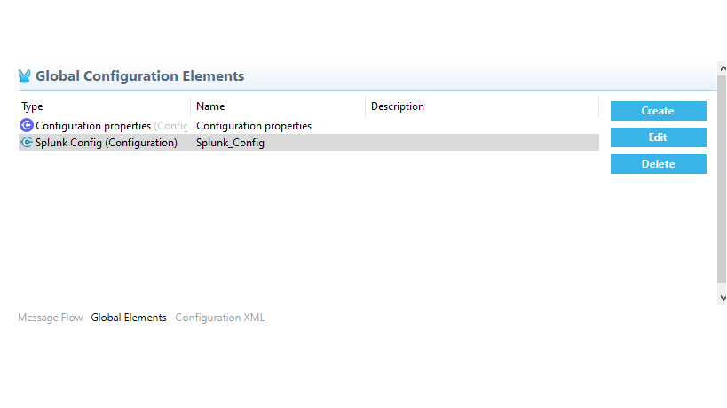
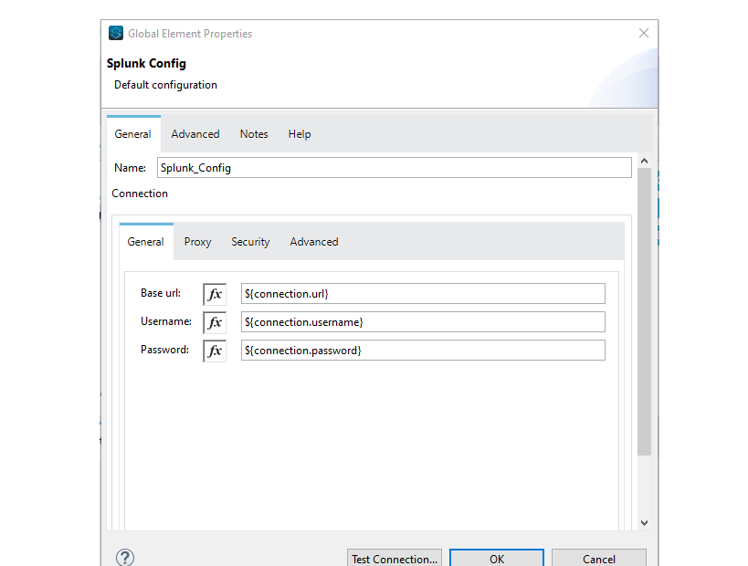
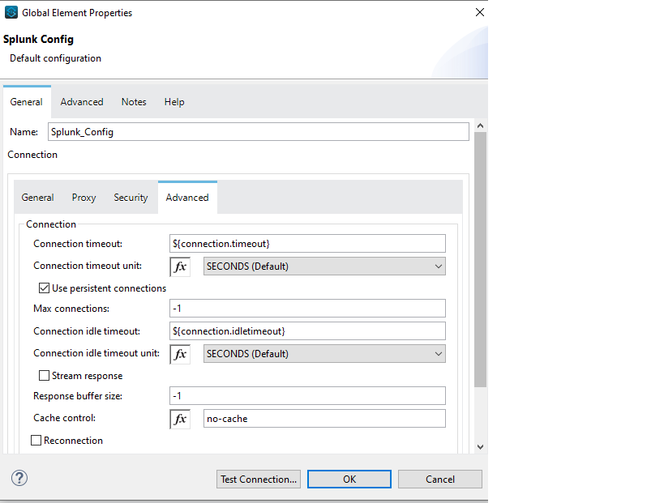
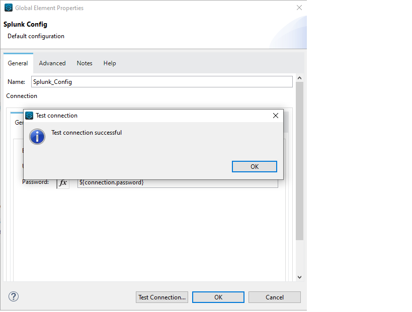
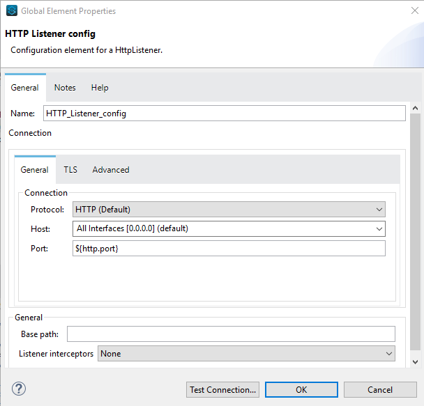
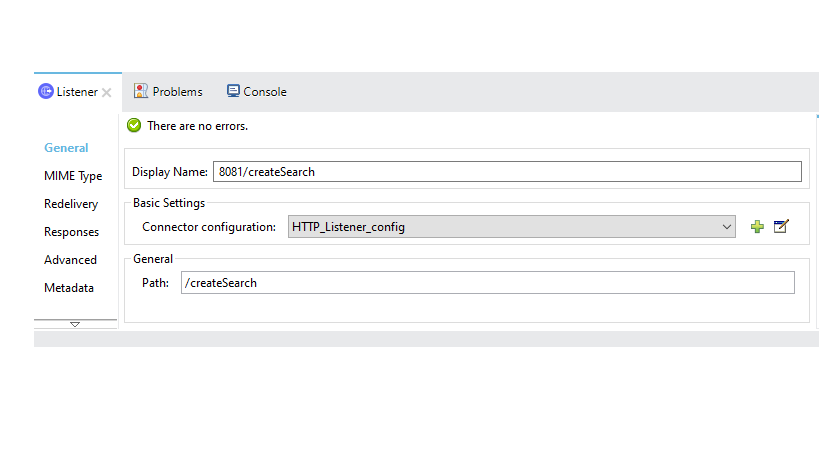
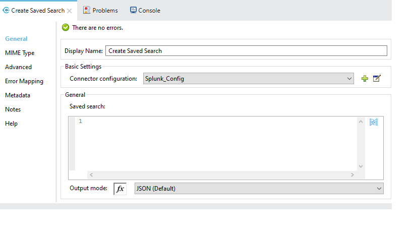
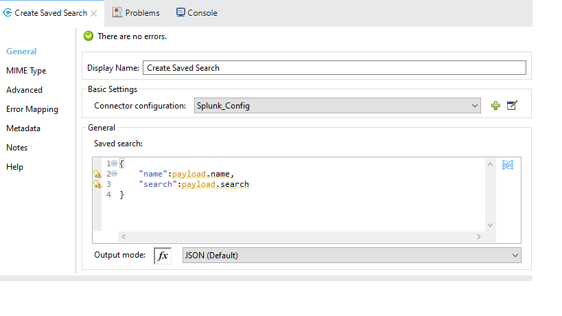
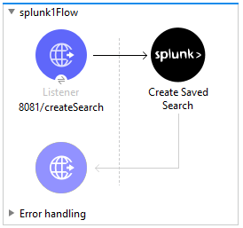
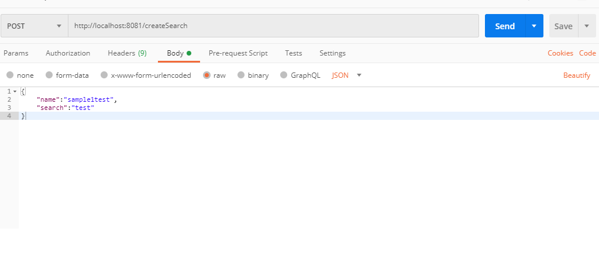

= Splunk Connector

MuleSoft Certified

== About Splunk

== About Splunk Connector

The Splunk Enterprise Server Connector performs the most common tasks against the Splunk API in an easy and consistent way. This connector allows you to not only directly send data from Anypoint Platform into the Splunk Index, but also to perform a wide variety of searches and indexing operations.


Use the connector to work with saved searches, create and run real-time blocking and one-shot searches, retrieve data models, and create and modify data inputs on the fly.

== Prerequisites
This document assumes that you are familiar with Mule, Anypoint Connectors,
Anypoint Studio Essentials, Mule flows, and Mule Global Elements.

To use Splunk connector, you need

* Anypoint Studio version 7.

=== Mule Compatibility

[width="100%", options="header"]
|=======
|Application/Service |Version
|Mule Runtime |4.x and later
|Anypoint Studio | 7.x and later
|=======

== What's New in this Connector

* This Splunk connector 2.0.0 is compatible with Mule 4.

== To Install this Connector in Anypoint Studio 7
You can use Splunk connector in Anypoint Studio by adding it as a dependency in your Mule application.

. Open your Mule project in Anypoint Studio.
. Add the connector as a dependency in the pom.xml file:

```
<dependency>
    <groupId>com.mulesoft.connectors</groupId>
    <artifactId>mule-splunk-connector</artifactId>
    <version>2.0.0</version>
    <classifier>mule-plugin</classifier>
</dependency>
```

When Studio has an update, a message displays in the lower right corner, which
you can click to install the update. After updating, update Maven pom.xml file dependencies to the new version.

== Configure in Studio

=== To Configure the Connector
* After adding connector dependency to Mule project, click on *Global Elements* tab at the base of the canvas.
* In the Global Mule Configuration Elements screen, click *Create*.
* In the Choose Global Type wizard, collapse connector configuration and select *'Splunk Connector Config'* and click OK.



* The configuration parameters to configure is

+
[options="header",width="50%"]
|============
|Field Name         |Value
|Baseurl            |Hostname  and URL of server hosting Splunk Server
|Username           |Enter the username  of Splunk server to log in with.
|Password           |Enter the corresponding password.
|Connection timeout |Timeout for connection, in milliseconds.
|Connection Idle Timeout|Timeout for connection, in Seconds(Default).

|============
+

* Credentials can be directly entered into the global configuration properties, or reference from a configuration file that contains these values.
Here we are adding credentials to application properties file and reference it using placeholders.




* Make a *Test Connection...* to check that the configuration is correct.



* On success, configuration is ready to use!

* Splunk_Connector_Config configuration should look like below in Configuration XML:
+
```xml
    <splunk:config name="Splunk_Config" doc:name="Splunk Config" doc:id="fe5aa8a0-5587-4ea5-9a9e-203726cc9318" >
		<splunk:connection baseUrl="${connection.url}" username="${connection.username}" password="${connection.password}" connectionTimeout="${connection.timeout}" connectionIdleTimeout="${connection.idletimeout}"/>
	</splunk:config>
```

* * Note* [[[how to get properties(note)]]]

== ​To Create a Mule Project in Anypoint Studio 7

The Splunk connector is an operation-based connector, which means that when you add the connector to your flow, you need to configure a specific operation the connector is intended to perform. Below is the "CreateSavedSearch" operation for better understanding

* Create new Mule Application in Studio and configure *HTTP Listener* to port 8081.



* Add "/createSearch" path to test the flow.



* Select *'CreateSavedSearch'* operation from Splunk connector, drag & drop it into canvas. Click on Create Saved Search operation.



* Select Splunk configuration from drop down which was already configured previously in global elements, or if required new configuration can be added by clicking green plus (+) symbol.


* Make sure to test your connection, if you have add new connection details.
* Enter required details for *Create Saved Search* operation and save.



* Save the Mule project.
* Complete flow looks as below.



* Run the project as a Mule Application by right-clicking the project name in the Package Explorer, selecting Run As > Mule Application.
* Open Postman and check the response after entering the URL *http://localhost:8081/createSearch*.



*You should see the json response . It means your Search is created with the name sample1test.

```<?xml version="1.0" encoding="UTF-8"?>

<mule xmlns:ee="http://www.mulesoft.org/schema/mule/ee/core" xmlns:splunk="http://www.mulesoft.org/schema/mule/splunk"
	xmlns:http="http://www.mulesoft.org/schema/mule/http"
	xmlns="http://www.mulesoft.org/schema/mule/core" xmlns:doc="http://www.mulesoft.org/schema/mule/documentation" xmlns:xsi="http://www.w3.org/2001/XMLSchema-instance" xsi:schemaLocation="http://www.mulesoft.org/schema/mule/core http://www.mulesoft.org/schema/mule/core/current/mule.xsd
http://www.mulesoft.org/schema/mule/http http://www.mulesoft.org/schema/mule/http/current/mule-http.xsd
http://www.mulesoft.org/schema/mule/splunk http://www.mulesoft.org/schema/mule/splunk/current/mule-splunk.xsd
http://www.mulesoft.org/schema/mule/ee/core http://www.mulesoft.org/schema/mule/ee/core/current/mule-ee.xsd">
	<http:listener-config name="HTTP_Listener_config" doc:name="HTTP Listener config" doc:id="023f826f-4b1f-43f3-b3c0-9dac4696074c" >
		<http:listener-connection host="0.0.0.0" port="8081" />
	</http:listener-config>
	<flow name="createSavedSearch_Flow" doc:id="65f3b94c-fdcc-4658-b0f2-89c9a9017954" >
		<http:listener doc:name="8081/createSearch" doc:id="49b240ff-85a4-4d7f-90f0-70d414b47b99" config-ref="HTTP_Listener_config" path="/createSearch"/>
		<splunk:create-saved-search doc:name="Create Saved Search" doc:id="0b0caa34-6f14-48d2-98ee-578dcd08d87a" config-ref="Splunk_Config">
			<splunk:saved-search ><![CDATA[#[{
	"name":payload.name,
	"search":payload.search
}]]]></splunk:saved-search>
		</splunk:create-saved-search>
	</flow>
</mule>

```

== See Also
[[[release note link]]]


